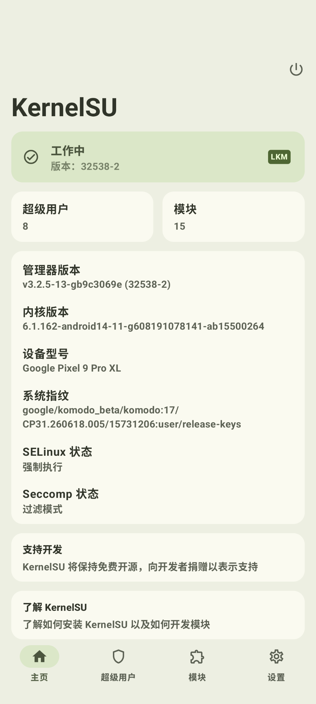

> [!NOTE] 
> :spoiler[*~~**因为太他妈多神人来问我一些神仙问题了 所以在此统一回答一下 顺手把安装教程也写了**~~*] 
> 有问题请先查看 [一些常见问题 **`(Q&A)`**](#%E4%B8%80%E4%BA%9B%E5%B8%B8%E8%A7%81%E9%97%AE%E9%A2%98-qa) 不要什么:spoiler[傻逼]问题都在群里问！

> [!IMPORTANT]
> 提问请严格按照 [**‼️ FBI WARNING ‼️ 不看鸡把短 10CM~ ‼️ FBI WARNING ‼️**](#%E6%8F%90%E9%97%AE%E7%9A%84%E8%89%BA%E6%9C%AF--%EF%B8%8F-fbi-warning-%EF%B8%8F%E4%B8%8D%E7%9C%8B%E9%B8%A1%E6%8A%8A%E7%9F%AD-10cm-%EF%B8%8F-fbi-warning-%EF%B8%8F) 章节的格式 :spoiler[**不然秒踢**]

# 🪨 **A Stone Badge & 不死图腾**

 项目🔗： [https://github.com/professor-lee/StoneBadge](https://github.com/professor-lee/StoneBadge)](https://stone.professorlee.work/api/stone/theovilardo/PixelPlayer)

```ASCII
        🟫🟫🟫🟫🟫🟫
      🟫🟨🟨🟨🟨🟨🟨🟫
      🟫🟨🟨🟨🟨🟨🟨🟫
      🟫🟧🟧🟨🟨🟧🟧🟫
      🟫⬜🟩🟧🟧⬜️🟩🟫
      🟫🟩🟩🟨🟨🟩🟩🟫
      🟫🟧🟧🟨🟨🟧🟧🟫
🟫🟫🟫🟫🟫🟧🟨🟨🟧🟫🟫🟫🟫🟫
🟫🟨🟧🟫🟨🟨🟧🟧🟨🟧🟫🟧🟨🟫
🟫🟫🟫🟨🟨🟨🟨🟨🟧🟧🟫🟫🟫🟫
      🟫🟨🟧🟧🟧🟧🟨🟫
      🟫🟫🟫🟫🟫🟫🟫🟫
        🟫🟨🟧🟧🟧🟫
        🟫🟨🟧🟧🟨🟫
          🟫🟫🟫🟫
```

---

# 提问的艺术  **‼️ FBI WARNING ‼️ 不看鸡把短 10CM~ ‼️ FBI WARNING ‼️**

> [!IMPORTANT]
> 首先的首先 最重要的是 不要随便什么问题都跑到群里去问 不要随便浪费人家群友的时间问这些文档里都有的:spoiler[*~~**智弱**~~*]问题了 确保你问的问题文档里没有再去群里问

## ❎ 错误的提问方式 ❎

> xxx 怎么搞/激活啊
> 
> xxx 为什么不能用啊


## ✅ 正确的提问方式 ✅

- 问题：`xxx？`

- 环境 **（这是最重要的 一眼就可以让人知道这个问题是否值得回答以及问题的根源）**：
  
    ```
    Root 方式
    Magisk /KernelSU /Apatch
    
    微信版本
    8.0.xx
    
    API 版本
    100 及更低/101/102
    
    Xposed API 调用保护
    未启用/已启用
    
    Dex 优化器包装
    支持/不支持
    
    框架版本
    xxx-it/irena/别的分支 (xxxx)
    
    管理器包名
    com.android.shell/org.lsposed.manager
    
    系统版本
    xx (API xx)
    
    设备
    xxx
    
    系统架构
    x86-64/arm64-v7a/v8a/v8a (4K)/risc-v
    ```
    
> [!TIP] 
> 给新手的小提示
> 
> 在 LSPosed 主界面长按即可复制设备信息
> 
> 
> 
> 微信版本在 **`微信设置` ➡️ `关于`** 里看

> **记得补充你的 Root 方式和微信版本号**

- 日志：`xxx.zip` :spoiler[*~~**（有最好 没有也罢）**~~*]

# 一些常见问题 **`(Q&A)`**

#### 1. Q: 打开微信卡第一屏然后闪退？

- 像这样：

[grid]


[/grid]

**A: 你的 LSPosed 肯定还在 1.9.x 版本 请按照 [PART 1️⃣ LSPosed 的安装](%E0%AD%A7%E2%8D%A4%E2%83%9D%20NewMiko%20Document%20%E2%98%83%2034c73d337a7d80b28a14d3829cf07b7d.md) 更新你的 LSPosed**

#### 2. Q: 打开微信设置闪退？

**A: 请按照 [Step 1️⃣ 加入 https://t.me/MikoCIBuilds 频道获取最新版 NewMiko](%E0%AD%A7%E2%8D%A4%E2%83%9D%20NewMiko%20Document%20%E2%98%83%2034c73d337a7d80b28a14d3829cf07b7d.md) 章节 更新你的 NewMiko 由于之前的某个版本由于不适配微信 `8.0.70` 版本 导致微信在 `8.0.70` 版本打开设置闪退**

#### 3. Q: 免 Root 能不能用？

> [!IMPORTANT] 
> **A:** 请**不要使用** **LSPatch**（俗称 ***免 Root***、***嵌入模块***） :spoiler[***~~除非你想被张小龙秒封！~~***]

#### 4. Q: 已成功激活  NewMiko 并且功能正常 但是 app 里显示 未激活 ？

- **A: 小明留给我们的陈年老 Bug 无视即可 在** **LSPosed `2.0.0` 及以上版本会出现**


> [!TIP]
> 给新手的小提示：
> 在 LSPosed 设置里 **关闭** `**强制显示桌面图标**` 功能并 **重启你的📱**
> 打开 `NewMiko` app ➡️ `更多设置` ➡️ 打开 **`隐藏桌面图标`**
> 这样你就不会看见这烦人的 **`未激活` 了**

[grid]


[/grid]


> [!TIP]
> 
> 此时若要打开 NewMiko app 的话 在 LSPosed 管理器里点 NewMiko ➡️ 右下角图标就可以了
>
> 

> **还有的话我想到再补吧 妈妈的 累死劳资了**

---

# 安装、激活教程

## PART 1️⃣ LSPosed 的安装

> [!IMPORTANT]
> 
> **此教程只针对 KernelSU 及其分支撰写 不保证 Magisk 以及 Apatch 用户跟随本教程一定能用上此模块**

### Step 1️⃣ 确保你的📱已经获取了 Root 权限


> [!TIP]
> 如果你通过小米机型[越狱](https://share.google/aimode/Lfi89lWdLXxOh0zVE)的~~半残废~~ Root 或者魅族的官方~~半残废~~ Root 使用 LSPosed 则可以忽略上一条

[grid]

[/grid]

### Step 2️⃣ 下载 Zygisk 实现模块 [ReZygisk](https://github.com/PerformanC/ReZygisk) 或者 [ZygiskNext](https://github.com/Dr-TSNG/ZygiskNext) 并刷入

::github{repo="PerformanC/ReZygisk"}

::github{repo="Dr-TSNG/ZygiskNext"}

> [!NOTE]
> *至于为什么有两个模块这件事么……是这样的： https://github.com/Dr-TSNG/ZygiskNext 一段时间前停止了开源 然后就有人搞了个开源的 https://github.com/PerformanC/ReZygisk 出来
>从安全性的角度 本人更建议 https://github.com/PerformanC/ReZygisk 毕竟闭源的模块的安全性么……这就全看模块作者良心了
> 但是吧 https://github.com/PerformanC/ReZygisk 这模块也是刚刚出来的 稳定性这块还是差一点的（虽然本人目前用着也没发现大问题）所以你自己取舍吧*

### Step 3️⃣ 下载  并且刷入

有两种方法下载 LSPosed:
1. 访问 [lsposed.zip](https://lsposed.zip) 直接下载
2. 如果无法访问 可加入 [tg@lsposed]（https://t.me/LSPosed） 群组 到群组内下载

> [!IMPORTANT]
>
> 自 2024年4月26日 LSPosed 恢复更新起 LSPosed 不再开源并且进行内部测试制 并且不再分发于 Github 上 用户必须进入 **https://t.me/LSPosed 群组** 获取稳定版更新 而想要内测版用户则需要申请进入 `LSPosed Internal Test` 内测群组 详情见 ⬇️
>    
> [https://t.me/LSPosed/275](https://t.me/LSPosed/275)
>    
> - 在此加入 LSPosed 频道 ⬇️
>                                 
> [LSPosed](https://t.me/LSPosed)
>                                 
> 
>                                 
> 内测群进群方式
>                                                 
> [https://t.me/LSPosed/287](https://t.me/LSPosed/287)
>                                                 
> - 🔗 在此 自己想办法解决吧
>                                                 
> ```fish
> echo aHR0cHM6Ly90Lm1lLytOZkh6dGZ5TkJaczJaRGxs | base64 -d
> ```

> [!IMPORTANT]
>
> 请使用 **LSPosed API 版本 ≥ `101`** 的版本（ LSPosed 版本 ≥ **`2.0.0`**）以防止出一些奇奇怪怪的问题
>
> > [!NOTE]
> > 奇奇怪怪的问题.png
> > 
> >
> >
> > 原因：未升级 LSPosed 2.0.0 及以上版本
> >
> > 

> [!TIP]
> 给新手的小提示
> 你可以在 LSPosed 主界面查看 LSPosed API 及 LSPosed 版本
> 

> [!TIP]
> 给新手的小提示：
> 你可以从 LSPosed 的压缩包里提取出 **`manager.apk`** 并安装 这样你的 LSPosed 就不再寄生在 `Shell` 里了 可以常驻在后台
> 

## PART 2️⃣ NewMiko 的安装与激活

### Step 1️⃣ 加入 [tg@MikoCIBuilds](https://t.me/MikoCIBuilds) 频道获取最新版  NewMiko、

[Miko CI Builds](https://t.me/MikoCIBuilds)

### Step 2️⃣ 安装  NewMiko 并在 LSPosed 里激活  NewMiko

1. 安装


2.LSPosed 主页 ➡️ 模块 ➡️ :newmiko: NewMiko（可能在下面）

3.NewMiko **`im.mingxi.miko`** ➡️ 启用模块 ➡️ 勾选微信 ➡️ 长按微信 ➡️ 强行停止 ➡️ 确认 ➡️ 启动

4.打开微信 ➡️ 我的 ➡️ 设置 ➡️ NewMiko ➡️ Enjoy!

[grid]


[/grid]

---