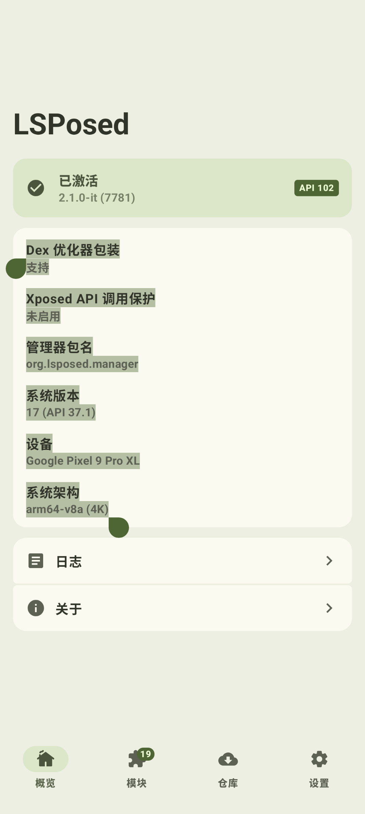
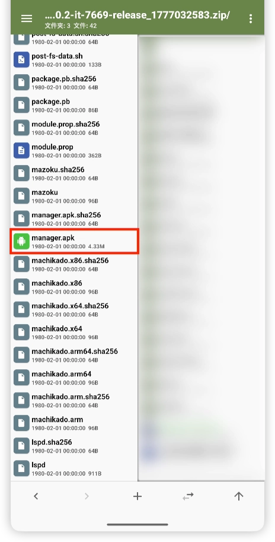

> [!TIP]
> 本页面内某些内容可能需要代理才能正常访问

> [!NOTE] 
> 提问请按照 [**提问的艺术**](#%E6%8F%90%E9%97%AE%E7%9A%84%E8%89%BA%E6%9C%AF--%EF%B8%8F-fbi-warning-%EF%B8%8F%E4%B8%8D%E7%9C%8B%E9%B8%A1%E6%8A%8A%E7%9F%AD-10cm-%EF%B8%8F-fbi-warning-%EF%B8%8F) 准备好一些必要的材料 免得开发者追着你问日志
> 有问题🉑先查看 [一些常见问题 **`(Q&A)`**](#%E4%B8%80%E4%BA%9B%E5%B8%B8%E8%A7%81%E9%97%AE%E9%A2%98-qa) 也许能回答你一些疑惑

# 🪨 **A Stone Badge & 不死图腾**

 项目🔗： [https://github.com/professor-lee/StoneBadge](https://github.com/professor-lee/StoneBadge)](https://stone.professorlee.work/api/stone/theovilardo/PixelPlayer)

```ASCII
        🟫🟫🟫🟫🟫🟫
      🟫🟨🟨🟨🟨🟨🟨🟫
      🟫🟨🟨🟨🟨🟨🟨🟫
      🟫🟧🟧🟨🟨🟧🟧🟫
      🟫⬜🟩🟧🟧⬜️🟩🟫
      🟫🟩🟩🟨🟨🟩🟩🟫
      🟫🟧🟧🟨🟨🟧🟧🟫
🟫🟫🟫🟫🟫🟧🟨🟨🟧🟫🟫🟫🟫🟫
🟫🟨🟧🟫🟨🟨🟧🟧🟨🟧🟫🟧🟨🟫
🟫🟫🟫🟨🟨🟨🟨🟨🟧🟧🟫🟫🟫🟫
      🟫🟨🟧🟧🟧🟧🟨🟫
      🟫🟫🟫🟫🟫🟫🟫🟫
        🟫🟨🟧🟧🟧🟫
        🟫🟨🟧🟧🟨🟫
          🟫🟫🟫🟫
```

---

# 提问的艺术

## ❎ 错误的提问方式 ❎

> [!NOTE]
>
> 请不要这样提问 错误的提问方式将使开发者无法解答你的问题
>
> > xxx 怎么搞/激活啊
> >
> > xxx 为什么不能用啊
>
> 
>
> > [!IMPORTANT]
> >
> > 进群前请确保你有一定的玩机基础 不然将会使沟通成为一场灾难
> >
> > 

## ✅ 正确的提问方式 ✅

- 问题：`xxx？`

- 环境：

    ```
    Root 方式
    Magisk /KernelSU /Apatch
    
    微信版本
    8.0.xx
    
    API 版本
    100 及更低/101/102
    
    Xposed API 调用保护
    未启用/已启用
    
    Dex 优化器包装
    支持/不支持
    
    框架版本
    xxx-it/irena/别的分支 (xxxx)
    
    管理器包名
    com.android.shell/org.lsposed.manager
    
    系统版本
    xx (API xx)
    
    设备
    xxx
    
    系统架构
    x86-64/arm64-v7a/v8a/v8a (4K)/risc-v
    ```

> [!TIP] 
> 给新手的小提示
> 
> 在 LSPosed 主界面长按即可复制设备信息
> 
> 
> 
> 微信版本在 **`微信设置` ➡️ `关于`** 里看

> **记得补充你的 Root 方式和微信版本号**

- 日志：`xxx.zip`

# 一些常见问题 **`(Q&A)`**

#### 1. 免 Root 能不能用？

<iframe src="https://t.me/c/4325719803/4601/24430" width="auto" height="auto"></iframe>

> [!IMPORTANT] 
> **A:** 请**不要使用 LSPatch、NPatch 等工具嵌入模块到微信** :spoiler[***~~除非你想被张小龙秒封！~~***]

> [!NOTE]
> 由于太多:spoiler[*煞笔*]拿着开源的项目重新套层皮就上架售卖了 加之群内大部分人有 Root 遂开发者已停止对嵌入模块的支持

> **还有的话我想到再补吧 妈妈的 累死劳资了**

---

# 安装、激活教程

## PART 1️⃣ LSPosed 的安装

> [!IMPORTANT]
> 
> **此教程只针对 KernelSU 及其分支撰写 不保证 Magisk 以及 Apatch 用户跟随本教程一定能用上此模块**

### Step 1️⃣ 确保你的📱已经获取了 Root 权限


> [!TIP]
> 如果你通过小米机型[越狱](https://share.google/aimode/Lfi89lWdLXxOh0zVE)的~~半残废~~ Root 或者魅族的官方~~半残废~~ Root 使用 LSPosed 则可以忽略上一条

[grid]

[/grid]

### Step 2️⃣ 下载 Zygisk 实现模块 [ReZygisk](https://github.com/PerformanC/ReZygisk) 或者 [ZygiskNext](https://github.com/Dr-TSNG/ZygiskNext)并刷入

::github{repo="PerformanC/ReZygisk"}

::github{repo="Dr-TSNG/ZygiskNext"}

> [!NOTE]
> *至于为什么有两个模块这件事么……是这样的： https://github.com/Dr-TSNG/ZygiskNext 一段时间前停止了开源 然后就有人搞了个开源的 https://github.com/PerformanC/ReZygisk 出来
> 从安全性的角度 本人更建议 https://github.com/PerformanC/ReZygisk 毕竟闭源的模块的安全性么……这就全看模块作者良心了
> 但是吧 https://github.com/PerformanC/ReZygisk 这模块也是刚刚出来的 稳定性这块还是差一点的（虽然本人目前用着也没发现大问题）所以你自己取舍吧*

### Step 3️⃣ 下载  并且刷入

有两种方法下载 LSPosed:
1. 访问 [lsposed.zip](https://lsposed.zip) 直接下载
2. 如果无法访问 可加入 [tg@lsposed](https://t.me/LSPosed) 到群组内下载

> [!IMPORTANT]
>
> 自 2024年4月26日 LSPosed 恢复更新起 LSPosed 不再开源并且进行内部测试制 并且不再分发于 Github 上 用户必须进入 **https://t.me/LSPosed 群组** 获取稳定版更新 而想要内测版用户则需要申请进入 `LSPosed Internal Test` 内测群组 详情见 ⬇️
>    
> 
> 
> 在此加入 LSPosed 频道 ⬇️
>    
> [LSPosed](https://t.me/LSPosed)
>                                 
> 
>                                 
> 内测群进群方式
>                                 
> <iframe src="https://t.me/LSPosed/287" width="auto" height="auto"></iframe>
>                                                 
> - 🔗 在此 自己想办法解决吧
>
> ```fish
>                                                 echo aHR0cHM6Ly90Lm1lLytOZkh6dGZ5TkJaczJaRGxs | base64 -d
> ```

> [!IMPORTANT]
>
> WeKit 每次发版会发 `legacy` 版本和 `standard` 版本（也就是 `api101` 版本） 强烈建议你根据上面的教程更新 LSPosed 至 API102 以防止出一些奇奇怪怪的问题

> [!TIP]
> 给新手的小提示
> 你可以在 LSPosed 主界面查看 LSPosed API 及 LSPosed 版本
> 

> [!TIP]
> 给新手的小提示：
> 你可以从 LSPosed 的压缩包里提取出 **`manager.apk`** 并安装 这样你的 LSPosed 就不再寄生在 `Shell` 里了 可以常驻在后台
> 

## PART 2️⃣ WeKit 的安装与激活

### Step 1️⃣ 获取最新版  Wekit

#### 方法 1️⃣ 加入 [Wekit Telegram 超级群组](https://t.me/+4XsfR-SWAtk1NGRl) 获取最新版  Wekit

[点击加入 Telegram 超级群组](https://t.me/+4XsfR-SWAtk1NGRl)

#### 方法 2️⃣ 到 [Github Action](https://github.com/Ujhhgtg/WeKit/actions/workflows/ci.yml) 下载最新版  Wekit

1. [点此进入 Github Action](https://github.com/Ujhhgtg/WeKit/actions/workflows/ci.yml)

2. 把浏览器 UA 调整成 PC

> [!NOTE]
> 也就是什么 `电脑模式` `桌面模式` 之类的模式

4. 找到最新 `master` 分支的 Action Runner 戳进去

- 

5. 页面滑到底 戳 `wekit-apk` 旁边的下载按钮
5. 

### Step 2️⃣ 安装  WeKit 并在 LSPosed 里激活  WeKit

1. 安装
1. [grid]


2. LSPosed 主页 ➡️ 模块 ➡️ WeKit（可能在下面）

3. WeKit ➡️ 启用模块 ➡️ 勾选微信 ➡️ 长按微信 ➡️ 强行停止 ➡️ 确认 ➡️ 启动

4. 打开微信 ➡️ 我的 ➡️ 设置 ➡️ WeKit ➡️ Enjoy!

[grid]


[/grid]

---

# About us

** WeKit 是一个功能丰富的微信 Xposed 模块，提供大量微信增强功能，涵盖聊天体验、界面美化、隐私保护、自动化等多个方面。 **

## 特色功能

- 基于 JavaScript 和 ~~*[WAuxiliary](https://github.com/HdShare/WAuxiliary_Public)*~~ Jvav 的脚本引擎
- 贴纸包同步 (Telegram Stickers Sync)
- 通知进化 (`MessagingStyle`)
- Markdown 消息渲染
- 指纹支付 (基于 TEE 的安全加密)
- 自动抢红包
- 单向删除好友检测
- 发送 SILK/MP3 语音
- 聊天工具栏
- 发送卡片消息
- 原生 Hook
- ~~支持免 Root 框架~~ 

[](https://github.com/Ujhhgtg/WeKit/actions/workflows/ci.yml)

### 致谢

[WeKit 上游](https://github.com/cwuom/WeKit)

[WAuxiliary](https://github.com/HdShare/WAuxiliary_Public)

[NewMiko](https://github.com/dartcv/NewMiko/blob/archives/)

[QAuxiliary](https://github.com/cinit/QAuxiliary)

[FingerprintPay](https://github.com/eritpchy/FingerprintPay)

[WADN](https://github.com/Ujhhgtg/wauxv_deobf_new) [WAD](https://github.com/Ujhhgtg/wauxv_deobf)

